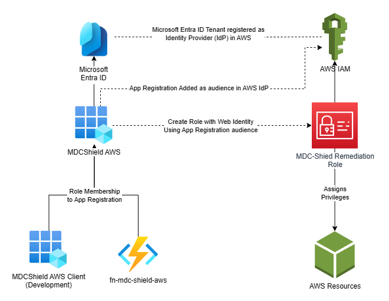
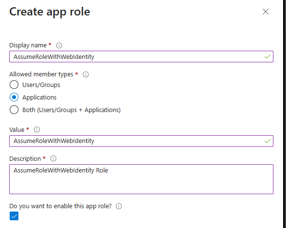
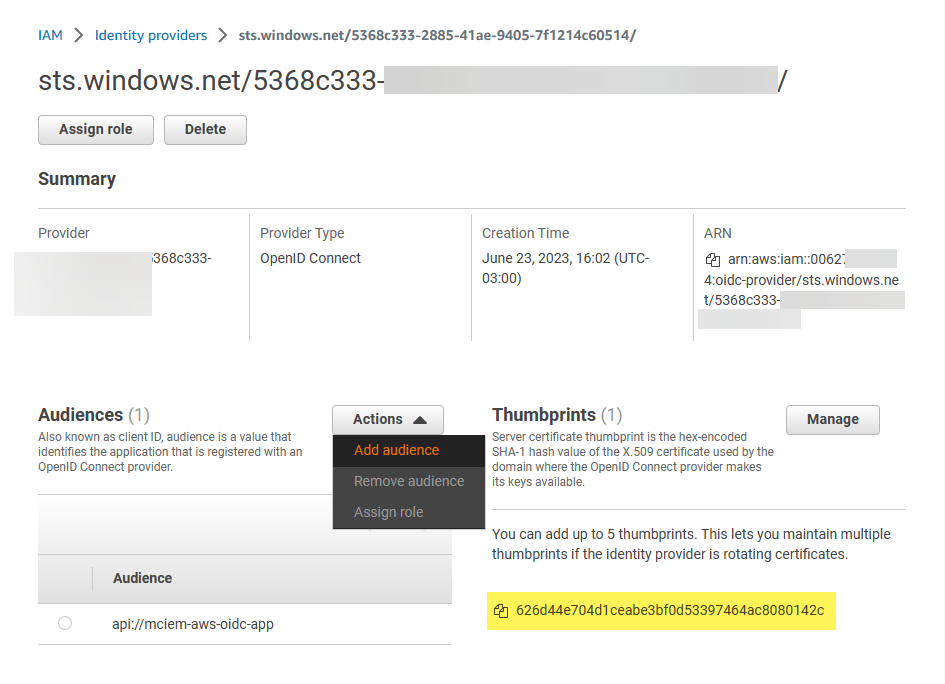

# Microsoft Defender for Cloud (MDC) Shield

## About this project

Remediation tasks in Microsoft Defender for Cloud can be easily achievable using Azure Policies and other built-in workflows for Azure. However, customers often struggle with remediation for AWS and GCP. To address this, I have created the MDC-Shield project to share some of the remediation tasks I have created for my customers and the community.

The basis for MDC-Shield is the use of an Azure Function that allows customers to run CLI commands from it. These commands can be triggered by a Workflow Logic App in Microsoft Defender for Cloud or Sentinel. By using CLI commands, we can generate a highly customizable interface for anyone interested in remediating cloud resources in an easy manner.

To keep the solution as simple as possible, authentication will be based on the Function's Managed Identity. The Managed Identity will be granted the necessary privileges in the cloud provider, including Azure.

To provision the role in Azure, we will attach a policy that allows the execution of the required CLI commands. It is important to properly manage and control this policy to avoid unnecessary privileges.

> Want to know more about how you can discover, monitor, and remediate permissions for identities or resources in your Multi-Cloud Environments? Take a look at [Microsoft Entra Permissions Management](https://www.microsoft.com/en-us/security/business/identity-access/microsoft-entra-permissions-management) and how it can help you achieve your goals.

## AWS



This diagram was inspired on René Bremer post in Medium about [How to Connect Azure AD Managed Identities to AWS Resources at Towards Data Science](https://towardsdatascience.com/how-to-connect-azure-ad-managed-identities-to-aws-resources-9353f3309efb)

### Prerequisites

1. Azure Subscription with the required permissions to create an Azure Function and Logic Apps for remediation tasks. It should resides in the same Azure AD Tenant as your Microsoft Defender for Cloud instance.
2. AWS Account with the required permissions to create IAM Roles and Policies.Additional IAM Roles and Policies may need to be created depending on the remediation tasks you plan to use to properly restrict access to the required resources.

### Deployment

#### Azure Function

- Azure AD App Registration

  - **Main App Registration**: This app registration will be associated with the AWS Role.
    - Go to Entra portal > Azure Active Directory > Applications > App Registrations > New Registration.
    - Specify the user-facing name for the application, for example, `MDC Shield AWS` and click Register.
    - After created, go to the App Registration > Manage > Expose an API
    - Under "Application ID URI" click "Add" and specify the URN/URI for the application. For example, `urn://mdc_shield_aws`.
    - Now go to the **App roles** option and create a new App Role with the following information:
      - DisplayName: `AssumeRoleWithWebIdentity`
      - Allowed member types: **Applications**
      - Value: `AssumeRoleWithWebIdentity`
      - Description: `Allows the application to assume a role in AWS using Web Identity`

      

- Azure Function Deployment

  - The Function can be deployed using the button below. Alternatively, you can use the folder `MDC-Shield-AWS` in this repository to adjust it and deploy directly from VSCode or your preferred IDE directly to Azure.

    [](https://portal.azure.com/#create/Microsoft.Template/uri/https%3A%2F%2Fraw%2Egithubusercontent%2Ecom%2Fdavi%2Dcruz%2FSecurity%2Fmain%2FMDC%2FMDC%2DShield%2Fazuredeployaws%2Ejson) 

  - During Function deployment (or manually if you used other methods) you'll need to fill in the following information:
    - **AZURE_AUTHORITY_HOST**: This is the default value for Azure AD. It has to be set to `login.microsoftonline.com`.
    - **AZURE_MSI_AUDIENCE**: This is where you'll specify the Main App Registration URI. It can be obtained from the Azure Portal or Microsoft Entra portal and has to end with `/.default` as the following example: `urn://mdc_shield_aws/.default`.

  > Note that unless explicitly specified, you'll always use the Client/Application ID for the resources. The Object ID is used for the Role Assignment.

- Azure AD Role Provisioning

  - **Production**: Now you'll need to grant the Managed Identity the previously created Application Role to the Main application. To make it easier I shared below a powershell snippet which grants the identities the necessary roles:

    ```powershell
    Connect-AzureAD
    $appId = Get-AzureADServicePrincipal -SearchString "<Main Service Principal Name>"
    $appRole = $AppId.AppRoles | ? {$_.DisplayName -eq "AssumeRoleWithWebIdentity"} #Adjust the Role name if you have used a different one in the previous steps
    $client = Get-AzureADServicePrincipal -SearchString "<Managed Identity Name>"
    
    ## Add Role Assignment
    New-AzureADServiceAppRoleAssignment -ObjectId $appId.ObjectId -ResourceId $appId.ObjectId -Id $appRole.Id -PrincipalId $client.ObjectId
    ```

- AWS Azure AD OpenID Connect

  - Now, in the AWS Portal, go to your organization and then navigate to IAM
  - If this is your first time integrating a Azure AD Solution to AWS IAM, you'll need to create a Identity provider. You can use the Cloud Formation template `CF-MicrosoftEntra-OIDC.yaml` available in the `MDC-Shield-AWS` folder in this repository.
  - After this deployment, be sure that the Main Application URI/URN is included in the valid audiences for the Identity Provider as below. If not, just include it manually and save the changes as it was created, without the `/.default` suffix, or update the used template to include it.

  

  - Thumbprint information highlighted in the above image can be obtained using AWS article at [Obtaining the thumbprint for an OpenID Connect Identity Provider](https://docs.aws.amazon.com/IAM/latest/UserGuide/id_roles_providers_create_oidc_verify-thumbprint.html). Microsoft's Azure Active Directory well-known URL is `https://login.microsoftonline.com/{tenant}/v2.0/.well-known/openid-configuration` as described in [OpenID Connect on the Microsoft identity platform](https://learn.microsoft.com/en-us/azure/active-directory/develop/v2-protocols-oidc#sample-request).

- AWS Role Provisioning

  - Once we have identity provider configured, we can now create the role that will be used by the Function to execute the remediation tasks. You can use the Cloud Formation template `CF-MDC-Shield-Role.yaml` available in the `MDC-Shield-AWS` folder in this repository. While deploying it, you must specify the Main Application URI/URN as the `Principal` parameter, which will be used to configure the trust relationship between the role and the identity provider.
  - Take note of the Role ARN as it will be used in the Function configuration.

### Testing the Function

To test your Function, you can use a sample payload using the PowerShell script below. Function URL and token can be obtained from the Azure Portal.

```powershell
# Replace your RoleARN with the one from your AWS Account
$header = @{ "x-functions-key" = "<Your Function Token>" }
$uri = "https://<your function address>/api/<your function name>"
$body = @"
{
  "cmd": [
    "ec2",
    "describe-instances"
  ],
  "aws_role_arn": "<your Role ARN>",
  "aws_session_name": "MDCShield",
  "aws_region": "us-east-2"
}
"@

Invoke-RestMethod -Method Post -Uri $uri -Body $body -Headers $header
```

### Logic App Integration

In a Logic App, you can implement this by using the following steps:

- Use the Function Connector to call the Function and use the output as the input for the next step.
- The payload must be in the above-mentioned format, and you can parse the output JSON based on the standard schema sample provided below or use your own schema based on the expected output of the function, according to the JSON format your command will return.

```json
{
  "$schema": "http://json-schema.org/draft-04/schema#",
  "type": "object",
  "properties": {
    "content": {
      "type": "string"
    }
  },
  "required": [
    "content"
  ]
}
```

## To Do

- [ ] Create a Custom Logic App Connector for easier usage in Logic Apps
- [ ] Create a extensible framework for custom or advanced remediation tasks
- [ ] Create a AWS Lambda function to be used as a custom connector for Logic Apps instead of Azure Function
- [ ] Reproduce the same concept for Azure and GCP

## Contributing

Pull requests are welcome. For major changes, please open an issue first to discuss what you would like to change.

## License: [MIT](https://choosealicense.com/licenses/mit/)

```plaintext
MIT License

Copyright (c) 2023 Davi Cruz

Permission is hereby granted, free of charge, to any person obtaining a copy
of this software and associated documentation files (the "Software"), to deal
in the Software without restriction, including without limitation the rights
to use, copy, modify, merge, publish, distribute, sublicense, and/or sell
copies of the Software, and to permit persons to whom the Software is
furnished to do so, subject to the following conditions:

The above copyright notice and this permission notice shall be included in all
copies or substantial portions of the Software.

THE SOFTWARE IS PROVIDED "AS IS", WITHOUT WARRANTY OF ANY KIND, EXPRESS OR
IMPLIED, INCLUDING BUT NOT LIMITED TO THE WARRANTIES OF MERCHANTABILITY,
FITNESS FOR A PARTICULAR PURPOSE AND NONINFRINGEMENT. IN NO EVENT SHALL THE
AUTHORS OR COPYRIGHT HOLDERS BE LIABLE FOR ANY CLAIM, DAMAGES OR OTHER
LIABILITY, WHETHER IN AN ACTION OF CONTRACT, TORT OR OTHERWISE, ARISING FROM,
OUT OF OR IN CONNECTION WITH THE SOFTWARE OR THE USE OR OTHER DEALINGS IN THE
SOFTWARE.
```
